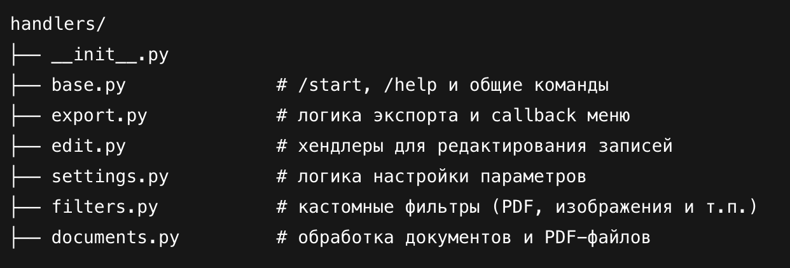
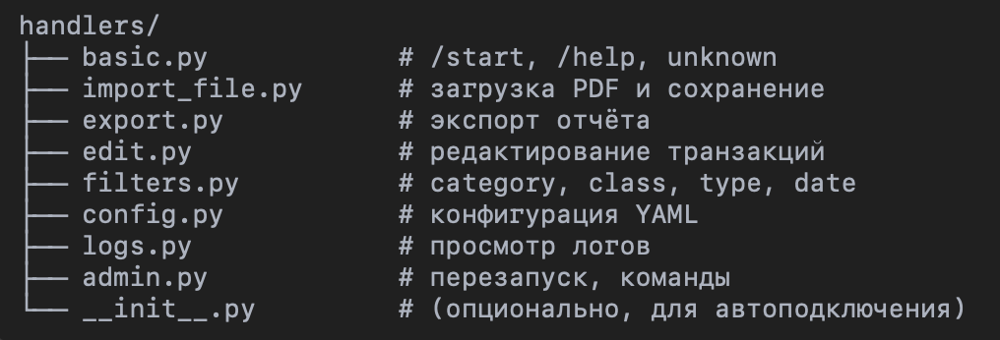
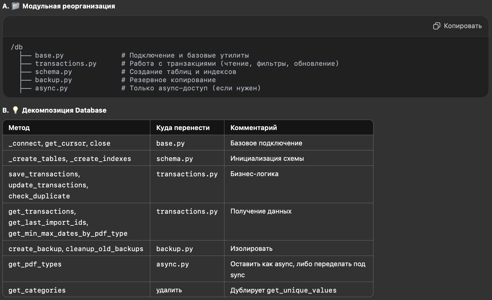

# Changelog

Все изменения проекта будут документироваться в этом файле.

Формат основан на [Keep a Changelog](https://keepachangelog.com/ru/1.0.0/),
а версии следуют [Semantic Versioning](https://semver.org/lang/ru/).

<!-- 🔹 Как правильно вести версии (SemVer)
Формат: MAJOR.MINOR.PATCH
MAJOR — критические изменения, ломающие обратную совместимость
MINOR — новые функции без нарушения совместимости
PATCH — исправления ошибок без новых функций -->

<!-- 📌 Правила ведения CHANGELOG.md
Всегда добавляйте записи в обратном хронологическом порядке (свежие сверху).
Используйте разделы:
Added — новые возможности
Changed — изменения в существующем коде
Deprecated — устаревшие функции
Removed — удаленные возможности
Fixed — исправления ошибок
Security — обновления безопасности -->

## [Неизданное] (Unreleased)
### Добавлено
- выбор столбцов для отчета (генерация отчёта по команде /export)
- объединить логику обработки pdf файлов (уже реализована система шаблонов и паттернов)
- Удаление записей и их логирование в отдельную таблицу + копия БД перед удалением
- бекапы и их отправка в чат с пользователем
- добавить просмотр/редактирование class_contractor.yaml
- добавить автотеста

### Изменено
- проверить бекап лог файлов, что старые файлы удаляются (сейчас backupCount=5)
- вынести в настройки размер файла pdf
- Изменена настройка дней бекапа БД и лог-файлов изменена на 15 дней и вынесена в настройки (settings.yaml)
- вынести в настройки уровень логирования

### Fix
- 

## [v3.7.ххх] - 2025-06-
### Изменено
- Рефакторинг и оптимизация bot.py (GPT-4o): оптимизация работы с pdf файлами - extract_transactions_pdf1.py, extract_transactions_pdf2.py, classify_transactions_pdf.py

pdf_processing/
├── __init__.py             # Импорт верхнеуровневых API
├── extractor.py            # PDF -> сырое CSV
├── csv_adapter.py          # Обработка странных CSV (Yandex, Tinkoff и т.п.)
├── classifier.py           # Классификация транзакций
└── pdf_patterns.yaml       # (оставим в config/, подключается извне)

------------------------------------------------------------------------

## [v3.8.1] - 2025-06-15
### fix
- get_template больше не пытается использовать json.загружает уже обработанное значение JSONB, предотвращая ошибки ввода.
    Скорректирована строка SQL-запроса и устранены ненужные json.loads при выборке фильтров шаблонов, поскольку JSONB уже возвращает объекты Python
- Меню экспорта: pdf тип, кнопка назад

------------------------------------------------------------------------

## [v3.8.0] - 2025-06-15
### Добавлено
- CODEX: Добавлены шаблоны для настроек фильтров - сохранение и применение шаблонов фильтров

------------------------------------------------------------------------

## [v3.7.6] - 2025-06-09
### Изменено
- 

### Fix
- Исправлено определение ID в боте: Выполняю команду /edit, в фильтре «Чек» - если указать число (например, 2578), то бот некорректно определяет, что я ему отправляю ID, а не текст изменения.
- Исправлен формат дат и сброс фильтров в /edit: Выполняю команду /edit, Далее "По фильтру" и поле дата нача и дата окончания заполняются в формате, как при команде /export = ДД.ММ.ГГГГ. Поля: Даты, Наличность и может другие фильтры сбрасываются на "по умолчанию" при выборе команды /edit.
- Выполняю команду /config, далее выбираю Добавить Паттерн-категорию, выбираю "Кафе, Посиделки" и отправляю боту Паттерн в виде сообщения: LAGOM.Бот ничего не отправляет в ответ. А должен был обновить yaml файл categories и прислать об этом информацию об успехе. 

------------------------------------------------------------------------

## [v3.7.5] - 2025-06-08
### Изменено
- поправлены категории, спец условия

### Fix
- доступ к боту только для администраторов + приветственное сообщение новым пользователям.
- Выполняю команду /edit, далее в фильтре «описание операции» указываю "текст", отправляю боту. 
    Бот отправляет в ответ только уведомление о найденных записях (найдено 3 записи для редактирования), а должен был показать меню для выбора полей для редактирования и установки новых параметров. В итоге: не было возможности перейти к выбору параметров для их изменения.

------------------------------------------------------------------------

## [v3.7.4(1)] - 2025-06-07
### Изменено
- Приветственное сообщение и инфо об ограничении доступа

------------------------------------------------------------------------

## [v3.7.4] - 2025-06-07
### Изменено
- доступ к боту только для администраторов

### Fix
- Отправка файлов конфигов в виде файла, а не текста, тк кол-во символов файла не умещается в сообщении телеграмм
    Обновлен send_single_config_file для отправки больших файлов конфигурации в виде документов. Теперь, если размер файла превышает 4000 символов, он отправляется с использованием reply_document ; в противном случае он отправляется в виде форматированного текста

## [v3.7.3] - 2025-06-02
### Изменено
- Рефакторинг и оптимизация bot.py (GPT-4o):

    | Модуль                       | Назначение                                               |
    | ---------------------------- | -------------------------------------------------------- |
    | `handlers/config.py`         | Обработка конфигов: YAML-редактирование, просмотр        |
    | `handlers/pdf_processing.py` | Обработка PDF/CSV и сохранение в базу                    |
    | `handlers/logs.py`           | Просмотр логов, лог-файлы                                |
    | `handlers/duplicates.py`     | Обработка дубликатов, `save_yes/no`, `update_duplicates` |
    | `handlers/restart.py`        | Отдельная перезагрузка, shutdown                         |

    handlers/
    ├── __init__.py
    ├── config.py
    ├── edit.py
    ├── export.py
    ├── filters.py
    ├── logs.py
    ├── pdf_processing.py
    ├── duplicates.py
    ├── restart.py

## [v3.7.2] - 2025-05-31
### Изменено
- Рефакторинг и оптимизация bot.py (GPT-4o), ссылка: 
- вынос в handlers/edit.py логики работы команды /edit
- устранение ошибок установки фильтров для /export

## [v3.7.1] - 2025-05-29
### Изменено
- Рефакторинг и оптимизация bot.py, ссылка: 
- Перемещение logging.py из utils/ в config/

## [v3.7.0] - 2025-05-26
### Изменено
- Рефакторинг и оптимизация database.py, ссылка: 
    23/05: Начнём с первого этапа рефакторинга (database.py -> db/..): вынесем логику подключения к базе и основных транзакционных операций в модули /db/base.py и /db/transactions.py (save_transactions, get_transactions, update_transactions, get_last_import_ids, get_unique_values, get_min_max_dates_by_pdf_type, check_existing_ids)
    + setup_logging в utils/logging.py

## [v3.6.4] - 2025-05-22
### Изменено
- Добавлено поле pdf_type в Настройки фильтров отчета (через скрпты в отдельном handlers/)

### Removed
- Удален флаг DISABLE_DUPLICATE_CHECK и связанный код

### Fix
- Исправление лишнего сообщения при скачивании логов, как файлом, так и последние "50" строк.

## [v3.6.3(2)] - 2025-05-20 21:25
### Изменено
- Вернул в database.py проверку DISABLE_DUPLICATE_CHECK и связанное логирование
- В check_duplicate = AND date_trunc('minute', transaction_date) = date_trunc('minute', %s)

## [v3.6.3(1)] - 2025-05-20 15:20
### Изменено
- Удаляем в database.py проверку DISABLE_DUPLICATE_CHECK и связанное логирование

## [v3.6.3] - 2025-05-20
### Добавлено
- При дубликатах (duplicates) формируется сообщение с количеством дубликатов (stats['duplicates']) и сохраненных записей (stats['new'])

### Изменено
- Установлен Часовой пояс для полей created_at и edited_at как MOSCOW_TZ

## [v3.6.2] - 2025-05-19
### Добавлено
- Реализовано получение информации о минимальной и максимальной дате по pdf_type
- Добавил поле "pdf_type" в команду /edit для возможности выбора и редактирования данного поля через бота
- Добавил настройку фильтра по полю "описание операции" через команду /edit и команду /export

### Изменено
- 

## [v3.6.1] - 2025-05-18 19:00
### Добавлено
-

### Изменено
- Изменен вывод в подписи к итоговому файлу Result количество записей, операций (счетчик), которые в нём содержатся

## [v3.6.0] - 2025-05-18
### Добавлено
- settings.yaml: общие настройки, добавил переменную по количеству строк лог-файла для отображения
- Добавлено поле import_id в фильтр для Экспорта данных, вынесено настройкой в settings.yaml (Количество последних import_id)
- Добавлено поле в БД: pdf_type

### Изменено
- Изменена сортировка в файле result от новых к старым (по аналогии, как это уже работает с сохранением записей в БД)
- Добавлена строка в docker-compose.yml для установки переменной TZ: указан Московский часовой пояс (Europe/Moscow)
- generate_report: добавлено применение фильтрами по полю import_id

## [v3.5.2] - 2025-05-14
### Добавлено
- rpi_scripts: запуск копирования файлов/папок с PRi на MacBook (папка RPi Commands)

### Изменено
- Команда /export: порядок имен столбцов приведен к формату в result.csv (метод db = get_transactions)
- Upd: categories.yaml и special_conditions.yaml
- Изменился формат выписки Сбер:
    Было: код авторизации был на строке с датой операции и временем
    Стало: код авторизации переместили на вторую строку к дате обработки (в соответствии с заголовками)
- Заменил текущий welcome_text - Файл: bot.py, Класс: TransactionProcessorBot

## [v3.5.1] - 2025-05-12
### Добавлено
-

### Изменено
- локальный запуск бекапов (DB_HOST=localhost python backup_manual.py)

### Fix
- изменения методов для команды /edit

## [v3.5.0] - 2025-05-11
### Добавлено
- Ручной бекап БД (backup_manual.py)
- Команда /edit: Изменение данных в БД 
    (Пользователь отправляет /edit, далее выбирает режим изменения "по ID" или "по фильтрам")

## [v3.4.1] - 2025-05-09
### Добавлено
- Выбор через интерактивное меню календаря (handle_calendar_callback)

### Изменено
- Для метода handle_calendar_callback сделана русификация: locale='ru'
- При вызове календаря изменения происходят в том же ID сообщения

### Fix
- скорректированы обработчики сообщений и их группа/приоритет обработки

## [v3.4.0] - 2025-05-08
### Добавлено
- Выбор через интерактивное меню календаря (handle_calendar_callback)

### Изменено
- уровень логирования (скрипт bot.py) вычитываем из переменной окружения LOG_LEVEL
- уровень логирования (скрипт database.py) вычитываем из переменной окружения LOG_LEVEL

## [v3.3.0] - 2025-05-06
### Добавлено
- [Частично, в docker compose закомментировано] Резервная копия БД (ежедневно, глубина 30 дней)
- DISABLE_DUPLICATE_CHECK - Флаг в .env - DISABLE_DUPLICATE_CHECK=true отключает проверку дубликатов, позволяя сохранять все транзакции

### Изменено
- изменение формата даты для фильтра на ДД.ММ.ГГГГ. Аналогично и для выгрузки в csv файл из БД
- В фильтрах к отчету Дата начала всегда равна первый день месяца

### Fix
- Редактирование YAML файлов через бота

## [v3.2.0] - 2025-05-04
### Добавлено
-

### Изменено
- Обновленный handle_text_input
- Обновленный set_category
- Добавленный set_type
- Добавлено логирование в методы set_start_date, set_end_date, set_category, set_type, set_counterparty, set_check_num, set_class
- Регистрация обработчиков проверена и подтверждена
- Удален неиспользуемый метод choose_category

### Fix
- Сохранение в БД даты транзакции в формате ГГГГ-ММ-ДД (вместо ГГГГ-ДД-ММ)
- При экспорте данных из БД переименовываем столбцы в РУС
- Запрос в БД по фильтрам дат (end_date_exclusive), включая эти даты (была проблема из-за времени)
    Запрос будет выбирать все транзакции, начиная с start_date 00:00:00 и до конца дня end_date 
    (т.е. до end_date_exclusive 00:00:00, не включая эту точку времени)
- Убираем NaN в выгрузках из БД и добавляем сортировку данных от новых к старым

## [v3.1.1] - 2025-05-02 17:10
### Добавлено
-

### Изменено
- Добавил поля в БД: Класс, Сумма (куда), Наличность (куда)
- Обновил метод save_transactions и метод get_transactions в database.py

## [v3.1.0] - 2025-05-02 16:25
### Добавлено
- database.py - добавим логирование и возврат статистики (Логировать количество добавленных и дублирующихся записей)
- Добавить обработчик в setup_handlers (Предоставлять пользователю выбор при обнаружении дубликатов)
- Добавить метод update_transaction в Database: обновление данных по ранее загруженным операциям по требованию пользователя

### Изменено
- bot.py - модифицируем обработчик и добавим новый

## [v3.0.0] - 2025-05-02
### Добавлено
- Создание БД PostgreSQL, сохранение в БД результатов итогового файла result.csv
- Модуль для работы с БД (database.py)

## [v2.3.0] - 2025-04-29 12:20
### Добавлено
- Добавил логирование для отслеживания процесса удаления файлов
- /add_settings для множества настроек:
    Берётся весь текст после /add_settings с помощью update.message.text[len('/add_settings'):].strip().
    Текст передаётся в функцию parse_user_settings(...), которая умеет разбирать несколько строк.
    Результат красиво формируется в виде списка.

### Fix
- Убрал update из вызова cleanup_files
- Улучшил обработку путей к файлам в cleanup_files

## [v2.2.0] - 2025-04-29
### Добавлено
- Добавление команды /add_settings: настройки будут задаваться через команду /add_settings

### Fix
- Декоратор admin_only будет правильно обрабатывать все случаи
- Меню конфигурации и логи будут работать корректно
- Номер карты 2578, то Контрагент == ! Наташа

## [v2.1.0] - 2025-04-29
### Добавлено
- Доступ только Админам, которые прописаны в виртуальном окружении:
    Добавлена функция load_admins(), которая читает переменную окружения ADMINS
    Список хранится в глобальной переменной ALLOWED_USERS как множество чисел
    Декоратор проверки прав:
    Создан декоратор @admin_only для проверки ID пользователя
    При отсутствии прав отправляется сообщение об ошибке
    Логирование:
    Добавлено логирование попыток доступа неавторизованных пользователей

## [v2.0.0] - 2025-04-28
### Добавлено
- Первая стабильная версия бота
- Поддержка Tinkoff, Сбербанк, Яндекс
- Система категоризации транзакций
- Обработка разных PDF (Сбер, Т, Яндекс) с настройки через YAML файлы
- Передача настроек обработки в тексте сообщения перед отправкой файла PDF (пользовательские настройки user_settings)
    user_settings = ['Наличность', 'Контрагент', 'Класс', 'Чек #', 'Описание операции']
- Настройки pdf вынесены в class_contractor.yaml (class, contractor, cash)

## [v1.0.0] - 2025-04-05
### Добавлено
- Первая стабильная версия бота по обработке PDF Tinkoff Platinum
3 скрипта:
1. extract_transactions_pdf1 - извлекает данные из файла pdf и формирует временный файл transactions_pdf1_temp.csv для анализа следующим скриптом 
2. extract_transactions_pdf2 - формирует очищенный и структурированный файл transactions_pdf2_combined.csv для анализа следующим скриптом
3. classify_transactions_pdf - классифицирует данные и формирует итоговый структурированный файл result.csv